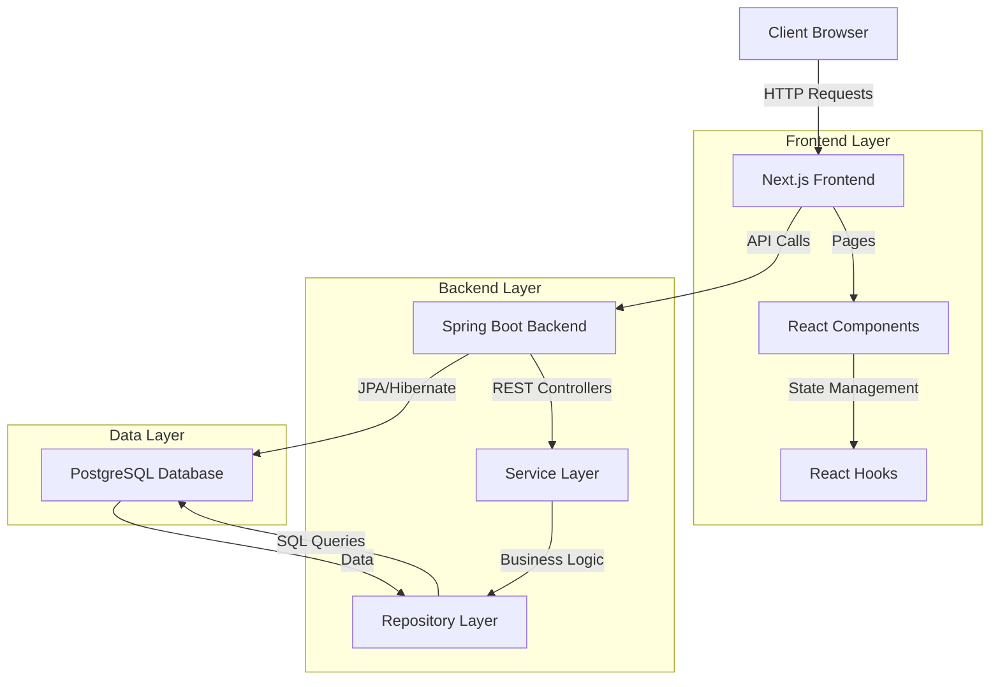
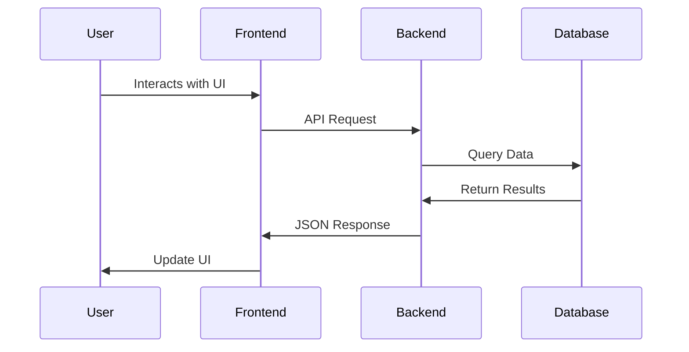

# CRM & FAQ Solution for Contact Centers

A comprehensive Customer Relationship Management (CRM) solution designed specifically for contact centers, with integrated FAQ management capabilities. This project was developed as part of an internship program.

## Table of Contents

- [Overview](#overview)
- [Features](#features)
- [Technology Stack](#technology-stack)
- [Project Structure](#project-structure)
- [Installation](#installation)
  - [Prerequisites](#prerequisites)
  - [Frontend Setup](#frontend-setup)
  - [Backend Setup](#backend-setup)
  - [Database Setup](#database-setup)
- [Running the Application](#running-the-application)
- [API Documentation](#api-documentation)
- [System Architecture](#system-architecture)
- [Data Flow](#data-flow)
- [Contributing](#contributing)
- [License](#license)

## Overview

This CRM solution provides tools for managing customer contacts, tracking support tickets, and maintaining a knowledge base of frequently asked questions. It's designed to streamline customer support operations in contact centers.

## Features

- **Contact Management**
  - Add, edit, and delete customer contacts
  - Search and filter contacts
  - View contact details and history

- **Ticket Management**
  - Create and assign support tickets
  - Track ticket status and priority
  - Search and filter tickets
  - Detailed ticket view with customer information

- **FAQ Management**
  - Create and organize FAQs by category
  - Track FAQ view counts
  - Search functionality for quick answers
  - Easy editing and updating of FAQ content

- **User Authentication**
  - Secure login and registration
  - Role-based access control
  - Password reset functionality

- **Dashboard**
  - Overview of key metrics
  - Recent activities
  - Performance indicators

## Technology Stack

### Frontend
- **Next.js** - React framework for server-rendered applications
- **TypeScript** - Typed JavaScript for better development experience
- **Tailwind CSS** - Utility-first CSS framework
- **Shadcn UI** - Component library for consistent design

### Backend
- **Spring Boot** - Java-based framework for building web applications
- **Spring Security** - Authentication and authorization
- **Spring Data JPA** - Data access layer

### Database
- **PostgreSQL** - Relational database management system

## Project Structure

```plaintext
crm-solution/
├── frontend/                # Next.js frontend application
│   ├── app/                 # Next.js app directory
│   ├── components/          # Reusable React components
│   ├── public/              # Static assets
│   └── ...
├── backend/                 # Spring Boot backend application
│   ├── src/
│   │   ├── main/java/com/crm/
│   │   │   ├── config/      # Configuration classes
│   │   │   ├── controller/  # REST controllers
│   │   │   ├── model/       # Entity classes
│   │   │   ├── repository/  # Data repositories
│   │   │   ├── service/     # Business logic
│   │   └── resources/       # Application properties, etc.
│   └── ...
└── database/                # Database scripts and migrations
```

## Installation

### Prerequisites

- Node.js (v18 or later)
- Java Development Kit (JDK) 17 or later
- PostgreSQL (v14 or later)
- Maven or Gradle

### Frontend Setup

```bash
git clone https://github.com/yourusername/crm-solution.git
cd crm-solution/frontend
npm install
```

Create a `.env.local` file:

```plaintext
NEXT_PUBLIC_API_URL=http://localhost:8080/api
```

### Backend Setup

```bash
cd ../backend
./mvnw clean install
```

Configure `src/main/resources/application.properties` with your database credentials.

### Database Setup

```bash
psql -U postgres
CREATE DATABASE crm_db;
\q
psql -U postgres -d crm_db -f database/database-setup.sql
```

## Running the Application

### Frontend

```bash
cd frontend
npm run dev
```

The frontend will be available at `http://localhost:3000`

### Backend

```bash
cd backend
./mvnw spring-boot:run
```

The backend API will be available at `http://localhost:8080`

## API Documentation

### Authentication Endpoints

- `POST /api/auth/register` - Register a new user
- `POST /api/auth/login` - Authenticate a user

### Contact Endpoints

- `GET /api/contacts` - Get all contacts
- `POST /api/contacts` - Create a new contact
- `PUT /api/contacts/{id}` - Update a contact
- `DELETE /api/contacts/{id}` - Delete a contact

### Ticket Endpoints

- `GET /api/tickets` - Get all tickets
- `POST /api/tickets` - Create a new ticket
- `PUT /api/tickets/{id}` - Update a ticket
- `DELETE /api/tickets/{id}` - Delete a ticket

### FAQ Endpoints

- `GET /api/faqs` - Get all FAQs
- `POST /api/faqs` - Create a new FAQ
- `PUT /api/faqs/{id}` - Update a FAQ
- `DELETE /api/faqs/{id}` - Delete a FAQ

## System Architecture




## Data Flow



## Contributing

Contributions are welcome! Feel free to submit a pull request or open an issue.


